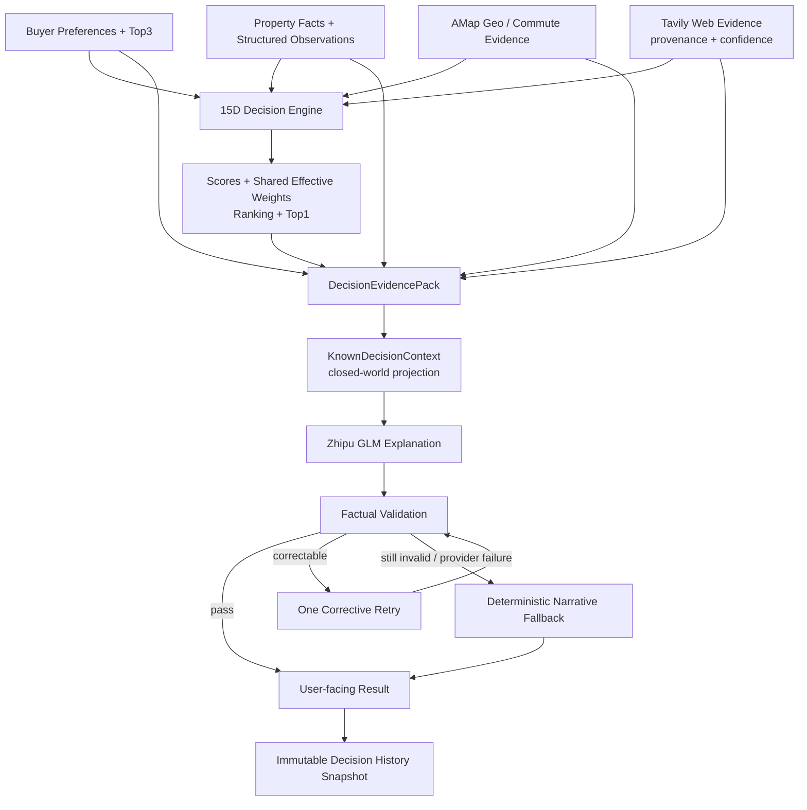

# HomeChoice

一个将用户偏好、结构化房源事实与外部可信证据结合起来，为购房者提供个性化候选排序和可解释建议的 AI 购房决策 Agent。

HomeChoice 面向已经筛选出多套候选房源、但难以形成稳定判断的购房者。它不是房源平台，也不是让大模型自由“选房”的 Prompt Demo：评分与排名由可复现的确定性 Decision Engine 负责，LLM 只在受约束的事实范围内解释为什么当前首选更适合用户。

## Live Demo

- **Production Demo:** [homechoice-ai-agent.vercel.app](https://homechoice-ai-agent.vercel.app/)
- **GitHub:** [Mokmok666/homechoice-ai-agent](https://github.com/Mokmok666/homechoice-ai-agent)
- **Version:** `v1.0.0` — Portfolio-ready MVP

> HomeChoice 是购房决策支持产品，不构成房产交易、投资、金融、法律或教育资格建议。

## 为什么做 HomeChoice

购房比较不是简单地把几套房的价格和面积排在一起：信息散落在房源资料、地图、公开网页和线下观察中；预算、通勤、空间与小区品质对每个家庭的重要性也不同。主观体验与客观数据混在一起时，用户很容易被单一亮点或信息缺口误导。

直接让通用大模型比较又会带来新的风险：事实可能被补全、相对关系可能写反、缺失数据可能被当成差评，同一输入也可能产生不稳定排序。用户真正需要的是：**一个尊重个人偏好的稳定结论，以及能够逐层核验的理由。**

## 核心产品流程

```text
添加并确认候选房源
        ↓
设置购房目的、预算、Top3、本人/伴侣通勤目标
        ↓
补充结构化房源事实与用户观察
        ↓
获取 AMap 地图/通勤证据与 Web 公开证据
        ↓
15 维 Decision Engine 计算共同可比维度、权重、得分与排序
        ↓
查看推荐结果与 AI 购房解读
        ↓
查看“为什么更适合您”、快速比较与完整 15 维证据
        ↓
保存不可变的 Decision History 快照
```

## 核心产品能力

### 1. 用户偏好建模

用户设置购房目的、最高预算、Top3 优先项，以及本人和可选伴侣的工作地点、通勤方式与理想/最大时长。Top3 决定“什么最重要”，硬约束决定哪些情况需要明确提示，而不是让系统给所有人一套固定排序。

### 2. 15 维决策框架

15 维是可按证据逐步启用的最大决策框架，不是必须填满的清单。缺少合法证据的维度保留为 `null / unknown`，不会为了“完整”而制造分数，也不会自动惩罚房源。

### 3. 确定性 Decision Engine

TypeScript 引擎负责个性化权重、维度评分、共同可比范围、总分、排序、Top1 与 Recommendation。所有候选使用同一组 Effective Comparable Dimensions 和同一个归一化权重向量，保证比较口径一致且结果可复现。

### 4. 外部 Evidence

- **AMap：**确认房源/工作地点、真实路线时间、公共交通、大型商业体与正规医院可达性。
- **Tavily Web Search：**搜索项目级公开资料，保留 URL、来源、日期与可信度。
- **Zhipu GLM：**对搜索结果做受约束的证据解释，并生成最终购房解读。

搜索失败不会阻断结果；外部证据只有在满足身份、相关性、来源和验证规则后才能进入对应决策语境。

### 5. AI 购房解读

LLM 不重新评分或改选 Top1。系统先把完整权威结果整理为 `DecisionEvidencePack`，再构建闭集 `KnownDecisionContext`；模型只能基于其中已知、可用的事实，把确定性推荐解释成简洁中文。

### 6. AI 可靠性

模型输出必须通过 Schema、Top1、候选身份、数字、比较方向、证据状态和未知事实等校验。失败时最多进行一次带校验原因的 corrective retry；仍失败、解析失败或供应商异常时，返回本地确定性 narrative fallback。用户只需点击一次。

系统还处理：unknown 中立、冲突证据隔离、签名缓存、过期分析识别、请求去重、Abort 与 stale response 防护。重新生成期间不会展示旧内容冒充当前结果。

### 7. 分层可解释性

结果页先给决策，再逐层展开依据：

1. 推荐房源、当前匹配度与价格假设；
2. 一段式 AI 购房解读；
3. 确定性的“为什么更适合您”；
4. 候选房源快速比较；
5. 可展开的完整 15 维分析与来源；
6. 可保存、不会随当前数据变化而重算的历史快照。

## 为什么不是“直接让大模型选房”

| Responsibility | Decision Engine | LLM |
| --- | --- | --- |
| 用户偏好与权重 | 按购房目的和 Top3 确定 | 读取，不修改 |
| 维度评分与缺失处理 | 确定性计算；缺失保持 `null` | 不补分、不猜测 |
| 排名、Top1、Recommendation | 唯一权威 | 不允许重排或反转 |
| 证据边界 | 维护来源、可信度与可比范围 | 只使用允许进入上下文的事实 |
| 用户解释 | 提供结构化理由与 15 维详情 | 将权威事实表达为自然语言 |
| 失败处理 | 仍可输出完整确定性结果 | 校验、一次纠错、确定性 fallback |

这种边界让排名可复现，让自然语言保持灵活，同时避免把模型的随机性变成购房结论的随机性。

## AI / Decision Architecture



更完整的边界说明见 [docs/ARCHITECTURE.md](docs/ARCHITECTURE.md)。

## 15 维决策模型

| 分组 | 维度 |
| --- | --- |
| 区位与家庭 | 地段成熟度、通勤匹配、公共交通便利度、商业配套、教育需求、医疗配套 |
| 房屋与居住 | 户型设计、空间匹配、楼龄、小区品质、物业服务 |
| 价格与安全边际 | 预算匹配、成交价合理性 |
| 长期价值 | 流动性、长期保值 |

三条关键规则：

1. **Missing ≠ 0：**没有证据的维度不参与当前得分，不以零分惩罚。
2. **Unknown ≠ negative：**未知只表示尚无法判断，不代表差或有风险。
3. **只比较公平可比项：**仅当所有当前候选在某维度都有合法分数时，该维度才进入本轮共同可比集合；其个性化权重随后统一归一化并应用于所有候选。

## Evidence 与可信度

HomeChoice 区分五类输入：用户提供的客观房源事实、结构化用户观察、AMap 证据、Web 公开证据，以及由这些信息确定性推导的 signals。

Web Evidence 保留来源标题、URL、域名、日期、抓取时间与来源层级，并区分：

- `verified`：可作为受支持事实；
- `partially_verified`：只允许谨慎表达；
- `conflicting`：不能支持正负主结论；
- `insufficient`：不进入事实陈述，主要作为待确认项。

核心原则是：**No evidence → no claim。** 挂牌信息不等于成交证据，营销描述不等于小区品质，附近学校也不等于入学资格。

## AI 可靠性设计

真实测试中出现过模型编造数字、把候选关系写反、将 unknown 写成负面、把预算匹配说成市场价格合理、输出内部术语，以及供应商超时或 JSON 不合法等问题。HomeChoice 没有通过放宽事实标准来换取“成功率”，而是把一次用户操作组织为完整的服务端生命周期：

```text
Model attempt
→ parse + factual validation
→ one corrective retry（仅限可纠错输出）
→ deterministic fallback
→ one final usable response
```

输入签名、缓存和 stale-response guard 共同确保旧请求不会覆盖新偏好；当上下文改变，旧分析会被标记过期，重新生成时旧正文隐藏。AI 失败不会影响确定性的评分、排序和推荐。

## 一次关键产品迭代：为什么没有要求 15 维全部有数据

早期方案容易把“资料完整”误当成“房源更好”：缺失维度可能拉低总分，AI 也会变成缺失数据报告。最终产品决策是：

- `null` 保持 `null`，不转换为 0；
- 缺失信息不产生负面结论；
- 所有候选只在共同有合法证据的维度上比较；
- 使用同一套有效权重，避免某套房因数据更多而获得不同评分口径；
- AI 只解释当前已知信息，重要未知项单独提示。

结果不是“等到资料齐全才决策”，而是在信息不完整的真实购房环境中，仍给出阶段性、可解释且知道边界的判断。

## 产品设计取舍

- **LLM 灵活性 vs 排名稳定性：**Decision Engine 拥有排名权，LLM 拥有表达权。
- **信息完整度 vs 决策可用性：**不强迫填满 15 维，用共同可比集合维持公平。
- **外部信息量 vs 幻觉风险：**保留 provenance、置信度和冲突状态，不能验证就不下结论。
- **模型自由度 vs 单击可靠性：**严格 validation、一次纠错与确定性 fallback。
- **透明度 vs 信息负担：**结果页采用“推荐 → 摘要 → 理由 → 比较 → 15 维详情”的渐进披露。

## 技术栈

- **Product & Web:** Next.js 15 App Router、React 19、TypeScript、Tailwind CSS、Radix/shadcn 基础、Lucide Icons
- **Decision & AI:** Deterministic TypeScript Decision Engine、Zhipu GLM
- **External Evidence:** AMap Web Service、Tavily Search
- **Persistence:** Supabase Anonymous Auth、PostgreSQL、RLS；LocalStorage fallback
- **Deployment:** Vercel、GitHub
- **Development workflow:** Git、Codex 辅助开发与回归验证

## 本地运行

```bash
npm install
npm run dev
```

服务端密钥不得加 `NEXT_PUBLIC_` 前缀。当前代码使用的环境变量名称如下（仅填写在本地或部署平台，不要提交真实值）：

| 变量 | 作用 | 边界 |
| --- | --- | --- |
| `NEXT_PUBLIC_SUPABASE_URL` | Supabase 项目 URL | 浏览器可用 |
| `NEXT_PUBLIC_SUPABASE_ANON_KEY` | Supabase publishable/anon key | 浏览器可用，仍受 RLS 约束 |
| `AMAP_WEB_SERVICE_KEY` | 地点、POI 与路线证据 | Server only |
| `TAVILY_API_KEY` | Web 搜索 | Server only |
| `ZHIPU_API_KEY` | Web 证据解释与 AI 购房解读 | Server only |
| `ZHIPU_MODEL` | 可选模型覆盖 | Server only；未配置时使用代码默认值 |

## Portfolio 文档

- [完整产品 Case Study](docs/CASE_STUDY.md)
- [技术—产品架构](docs/ARCHITECTURE.md)
- [面试表达指南](docs/INTERVIEW_GUIDE.md)
- [简历表述](docs/RESUME_BULLETS.md)
- [未来指标框架](docs/PRODUCT_METRICS.md)
- [评估计划](docs/EVAL_PLAN.md)
- [产品截图指南](docs/SCREENSHOT_GUIDE.md)

## 项目状态

`v1.0.0` 已完成产品设计、确定性个性化排序、AMap/Web Evidence、AI 解释、可靠性保护、Supabase 持久化、回归验证与 Vercel 部署。

当前限制：公开证据覆盖取决于数据源可用性；这是决策支持 MVP，不提供交易、估值预测或教育资格承诺；AI 摘要聚焦解释当前首选，完整候选差异由结构化比较与 15 维详情承载。
