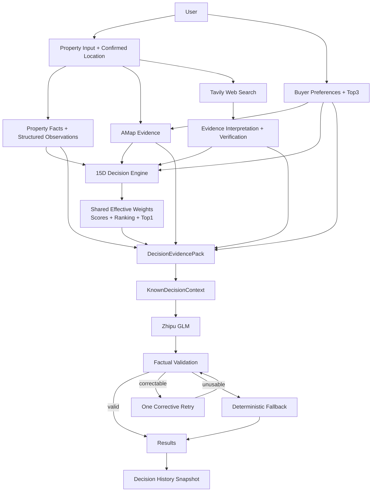
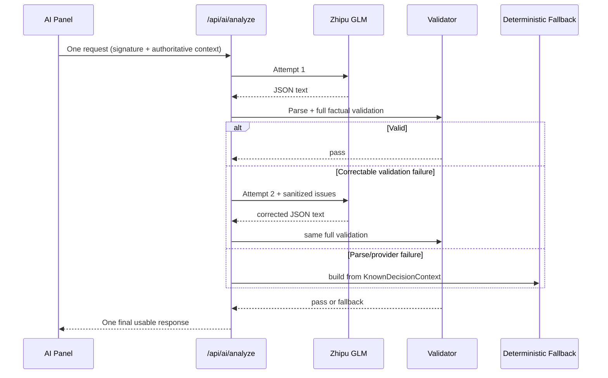

# HomeChoice 技术—产品架构

## 1. 架构目标

HomeChoice 的架构围绕三个问题设计：

1. 如何让个性化排序稳定、可复现？
2. 如何让外部信息可追溯，而不是成为模型幻觉入口？
3. 如何让模型失败不等于用户任务失败？

因此系统不是“输入全部资料 → LLM 选房”，而是确定性决策与生成式解释分层。

## 2. System Layers

| Layer | 主要职责 | 权威边界 |
| --- | --- | --- |
| Input | 房源、确认位置、价格、户型、结构化观察、Buyer Preferences、Top3 | 用户输入与确认事实 |
| External Evidence | AMap 路线/POI；Tavily Web Search；Zhipu 证据解释 | 提供带状态和来源的证据，不决定排名 |
| Decision | 15 维评分、共同可比集合、有效权重、总分、排序、Recommendation | 唯一评分与排名权威 |
| AI Context | `DecisionEvidencePack` 与 `KnownDecisionContext` | 固化可用事实和候选关系 |
| Generation | Zhipu GLM 生成一段式购房解读 | 只负责表达，不重算 |
| Reliability | Schema/factual validation、一次纠错、fallback、signature/race guard | 阻止不安全文本进入 UI |
| Presentation | 推荐、AI 解读、确定性理由、快速比较、15 维详情 | 渐进披露，不改变业务结果 |
| Persistence | LocalStorage、Supabase Anonymous Auth + RLS、History snapshot | 保存当前数据和不可变决策快照 |

## 3. End-to-End Data Flow



## 4. Decision Engine

### 4.1 Input

`runDecisionEngine` 接收：

- `Property[]`；
- `BuyerPreferences`；
- 固定分析日期；
- 可选 `GeoEvidenceByProperty`；
- 可选 `WebEvidenceByProperty`。

### 4.2 Personalized Intended Weights

购房目的选择基础先验；Top3 依次获得组权重；没有教育需求时教育维度被关闭。此时得到的是用户意图权重，不等于最终参与比较的权重。

### 4.3 Shared Comparable Set

引擎先为所有候选计算 15 维状态，再选择“每个候选都有合法非 null 分数”的维度。只有这些维度进入 `effectiveComparableDimensions`。

随后 `calculateEffectiveWeights` 在共同集合内把 intended weights 归一化为 100%。每个候选使用同一向量，避免候选 A 用 8 个维度、候选 B 用 11 个维度造成不公平总分。

### 4.4 Ranking Authority

总分仅聚合有效维度。排序先看总分，再看数据完整度，最后以 property ID 提供稳定 tie-break。Recommendation、hard mismatch、confidence 与 provisional 状态都由确定性代码产生。

LLM 没有调用这些计算函数的权限，也不能在返回结构中提供 score、ranking、weight 或 recommendation。

## 5. The 15 Dimensions

当前代码中的维度为：

1. 地段成熟度 `location_maturity`
2. 通勤匹配 `commute`
3. 公共交通便利度 `public_transport`
4. 商业配套 `commercial_amenities`
5. 教育需求 `education`
6. 医疗配套 `medical_amenities`
7. 户型设计 `layout_design`
8. 空间匹配 `space_match`
9. 楼龄 `building_age`
10. 小区品质 `community_quality`
11. 物业服务 `property_management`
12. 预算匹配 `budget_match`
13. 成交价合理性 `transaction_price_reasonableness`
14. 流动性 `liquidity`
15. 长期保值 `value_preservation`

每个维度声明 preferred evidence、weak evidence 和 missing behavior。部分维度可确定性评分，部分依赖结构化外部证据，长期保值只从已有底层评分推导，不做升值预测。

## 6. External Evidence

### 6.1 AMap

服务端 Route Handlers 使用 `AMAP_WEB_SERVICE_KEY`，浏览器不接触密钥。系统支持：

- 全国城市/行政区与地点搜索；
- 房源和工作地点确认；
- 驾车、公交、步行、骑行路线；
- 地铁/公交、大型商业体与正规医院 POI。

确认坐标优先于地址 geocoding。缓存身份包含稳定位置、目的地和模式；理想/最大通勤阈值变化只重算分数，不重复请求地图。

### 6.2 Web Evidence

运行时 Web Search Provider 为 Tavily。查询按项目名、城市、行政区和目标维度构造，结果经过：

1. 房源身份与近名项目过滤；
2. 城市/行政区与维度相关性判断；
3. URL/标题去重；
4. 来源层级与置信度标注；
5. Zhipu 受约束解释；
6. verified/partial/conflicting/insufficient 分类。

系统不保存整页正文，不让搜索摘要直接生成分数。交易、挂牌和未知价格线索保持独立语义。

## 7. DecisionEvidencePack

`DecisionEvidencePack` 是 AI 分析的权威审计包，直接从上游真实数据构建，不经过 Narrative Facts 过滤。它包含：

- 完整 Buyer Context 与 Top3；
- 按确定性排名排序的候选 Property；
- 每套房全部 15 维结果；
- intended/effective weights 与共同可比集合；
- Ranking、Top1、Recommendation 和 candidate comparisons；
- AMap Evidence；
- 原始规范化 Web Evidence；
- verified scoreable/contextual evidence；
- 来源、置信度、验证状态、hard mismatches 和 derived signals。

Evidence Pack 不重新做决策，只把引擎结果与其来源固定在同一个结构中，供验证、解释与测试使用。

## 8. KnownDecisionContext

正常模型路径不会把庞大的 Evidence Pack 原样倾倒给 GLM。`KnownDecisionContext` 从 Pack 生成一个 closed-world projection：

- authoritative Top1 与候选顺序；
- Buyer 预算、购房目的和有效 Top3；
- 共同可比维度与权重；
- 最重要的已知因素与受约束关系；
- 可用 AMap、verified/partial Web Evidence；
- 可能影响当前排序的重要待确认项。

它的目的不是替代 Evidence Pack，而是降低上下文噪声和模型自由推导空间。Validation 会重新从 canonical Evidence Pack 构建并核对这个 Context。

## 9. AI Generation and Reliability



### Validation protects

- Schema 与字段白名单；
- Top1、候选 ID/名称与排名权威；
- 数字必须存在于 Evidence Pack；
- 通勤、预算、维度比较方向；
- 挂牌价与预期/已确认成交价语义；
- unknown、partial、conflicting 的表达边界；
- educationNeed=none；
- 内部术语、非法 score/ranking/recommendation 字段。

最多只有两次 provider call。网络、认证、额度、超时或解析失败不会触发无限重试；只要权威上下文可构建，API 返回确定性 fallback。

## 10. Frontend Concurrency and Cache

AI Panel 使用 input signature、缓存、`isGeneratingRef`、`AbortController`、generation counter 和 Top1 guard：

- 同一点击只产生一个前端请求；
- loading 持续覆盖服务端整个生命周期；
- 上下文变化后旧缓存变 stale；
- 旧请求晚返回时不会覆盖新上下文；
- 重新生成期间旧正文隐藏；
- 最终安全结果按 signature 保存。

Geo、Commute、Web 和 AI 使用各自与语义相关的稳定签名，避免预算变化触发 Web 搜索，也避免只改阈值重复请求路线。

## 11. Persistence and History

- 浏览器始终有 LocalStorage 路径；
- 配置 Supabase 后，客户端通过 Anonymous Auth 获得 authenticated role；
- `properties`、`buyer_preferences`、`decision_history` 使用 RLS 按 `auth.uid()` 隔离；
- 首次匿名会话会迁移已有本地数据；云端失败时回退本地；
- History 保存深拷贝快照，历史详情不会重新运行当前 Decision Engine；
- 兼容旧字段和旧 snapshot，不强迫手工迁移。

## 12. Production Deployment

- 单一 Next.js App Router 仓库；
- API 使用 Node.js Route Handlers 和标准 `fetch`；
- Server-only 密钥：AMap、Tavily、Zhipu；
- 浏览器变量：Supabase URL 与 publishable/anon key；
- Vercel 部署；Supabase 提供持久化与 RLS；
- 外部服务故障采用 partial/unavailable/fallback 语义，不阻断确定性 Results。

## 13. Boundary Summary

```text
Preferences define importance.
Evidence defines what is known.
Decision Engine defines ranking.
LLM defines wording.
Validation defines what may reach the user.
History preserves what the user decided at that time.
```
